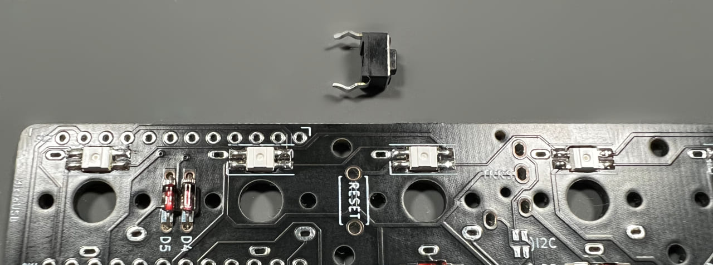
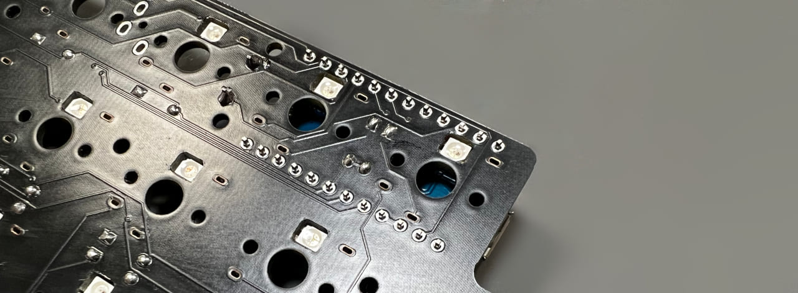
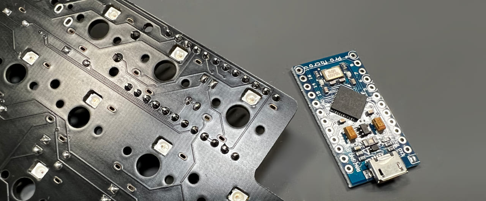
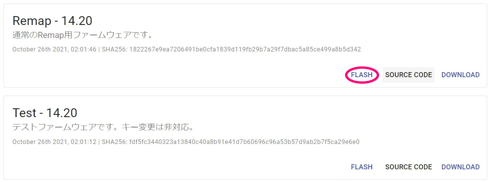

# Armors キーパッド ビルドガイド
- [キット内容](#キット内容)
- [組み立て方（はんだ付け）](#組み立て方はんだ付け)
- [動作テスト](#動作テスト)
- [組み立て方（後半）](#組み立て方後半)
- [カスタマイズ](#カスタマイズ)
- [その他](#その他)

## キット内容
  
||部品名|数| |
|-|-|-|-|
|1|メインボード|1||
|2|ミドルプレート|1||
|3|ボトムプレート|1||
|4|ボトムプレート|1||
|5|ネジ（短）|12|3mm|
|6|ネジ（長）|8|5mm|
|7|スペーサー（短）|6|3mm|
|8|スペーサー（長）|4|9mm|
|9|ダイオード|17||
|10|リセットスイッチ|1||
|11|ゴム足|4||

### キット以外に必要なもの
|部品名|数||
|-|-|-|
|[Pro Micro](https://shop.yushakobo.jp/products/pro-micro)|1||
|キースイッチ|17|[Kailh choc V1](https://shop.yushakobo.jp/collections/all-switches/products/pg1350)、もしくは[Kailh Choc V2](https://shop.yushakobo.jp/collections/all-switches/products/kailh-choc-v2)|
|キーキャップ|17|V1は[専用キーキャップ](https://shop.yushakobo.jp/collections/keycaps/For-Choc-v1)、V2は[CherryMX互換](https://shop.yushakobo.jp/collections/keycaps/cherry-mx-%E4%BA%92%E6%8F%9B-%E3%82%AD%E3%83%BC%E3%82%AD%E3%83%A3%E3%83%83%E3%83%97)です。|
|Micro-USB ケーブル|1||
 - [Pro Micro互換品とコンスルーの対応表](promicro.md)  

### LED（[取り付け方](led.md)）
|部品名|数||
|-|-|-|
|[SK6812MINI-E](https://shop.yushakobo.jp/products/sk6812mini-e-10)|17|バックライト|
|[WS2812B](https://shop.yushakobo.jp/products/a0800ws-01-10)|3|アンダーグロー|

### 必要な工具
|工具名|
|-|
|はんだごて|
|はんだ|
|精密ドライバー|
|ニッパー等ダイオードの足を切れるもの|
|エポシキ接着剤|

## 組み立て方（はんだ付け）
ダイオードをD1からD17まで取り付けます。  
足を曲げて裏から差し込みます。  
  
ダイオードには向きがあります。三角形の先の棒と黒線を合わせましょう。  

表で更に足を曲げて抜けないようにします。  
  
ダイオードと並行に曲げるとあとでキースイッチに干渉しにくいです。  

はんだ付けをして足を切ります。  
  

リセットスイッチを裏から差し込み表ではんだ付けします。  
  

Pro Microの取り付け場所にピンヘッダーの短い側を差し込みます。
  
位置決めのためにPro Mioroを乗せますが、はんだ付けはせず表にします。
  
  
メインボードにピンヘッダーをはんだ付けします。
  
Pro Microをいったん外します。

キースイッチを表から差し込み裏ではんだ付けします。  
  

隠れてしまうダイオードの方向が合っているか、キースイッチの足がはんだ付けされているかを再度確認してください。  
足をニッパーで切ったらはんだ付けします。
  
  

## 動作テスト
Pro Microに動作ソフト（ファームウェア）を書き込んで動作確認をしましょう。  
キットとPCをUSBケーブルでつないでください。   

下のwebサイトにアクセスしてください。
- https://remap-keys.app/catalog/1yh5TjeTVQeXTPtIVrOS/firmware

テストファームウェアを選んでFLASHします。
  
  

キットのリセットスイッチを押すとArduino Microが現れるので、クリックして接続します。
 

書き込みが完了したらウィンドウを閉じて大丈夫です。
 

アドレスバーやテキストエディタを使ってすべてのスイッチが反応することを確かめてください。  
お疲れ様でした。問題がなければはんだ付けは終了です。

## 組み立て方（後半）
USBケーブルを抜いてプレートを組付けます。  
アクリルからは保護フィルムを剥がしてください。割れやすいので気をつけましょう。  

メインボード裏面の赤丸の箇所にスペーサー（短）をネジ（短）で取り付けてミドルプレート（透明・中）を嵌めます。
  
ボトムプレート（黒・中）をネジ（短）で止めます。  

メインボードの残ったネジ穴にスペーサー（長）をネジ（長）で取り付け、ボトムプレート（透明・小）をネジ（長）で止めます。  
  

キーキャップを取り付けたら先ほどと同様の手順で本番用のファームウェアに更新しましょう。
- https://remap-keys.app/catalog/1yh5TjeTVQeXTPtIVrOS/firmware
  

ゴム足を貼ったら完成です。  
  

## カスタマイズ
このキットはレイヤー機能を使っています。

[Keyboard Layout Editor で見る](http://www.keyboard-layout-editor.com/#/gists/2c37559177f8a87ce5277c5e55365e61)  

使わないキーを削除したり使用頻度の高いキーを押しやすい位置に変更してみましょう。  

ChromeかEdgeでRemapにアクセスしてください。  
- Remap https://remap-keys.app/

  
左を選んで進んでいくとアドレスバーからメッセージが出てキーボードを選択できます。  

キーマップをドラッグアンドドロップで変更し右上のflashボタンを押すと反映されます。
  

## 液晶タブレットに乗せる場合
1番上の行を引っ掛ける事で液タブに乗せる事ができます。
　　
ゴム足を外して両面テープで固定すると安定します。  
跡が残るといけないので画面には保護フィルムを貼ってください。  

## その他
ファームウェアのフォルダ  
https://github.com/Taro-Hayashi/qmk_firmware/tree/tarohayashi/keyboards/tarohayashi/armors  

VIA用JSONファイル [armors.json](https://github.com/Taro-Hayashi/Armors/releases/download/14.15/armors.json)  

ミドル、ボトムプレートのデザインデータ  
[armors_plates.zip](https://github.com/Taro-Hayashi/Armors/releases/download/14.31/armors_plates.zip)  
発注先のルールに沿ってデータを修正してください。  

ご不明な点があればBOOTHのメッセージやtwitterでいつでも聞いてください。  

foostan様のフットプリントを流用、改変して使わせていただきました。  
https://github.com/foostan/kbd/  
https://github.com/foostan/kbd/blob/master/LICENSE  

- BOOTH: https://tarohayashi.booth.pm/items/3154455
