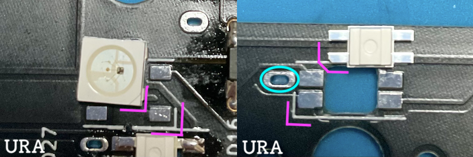
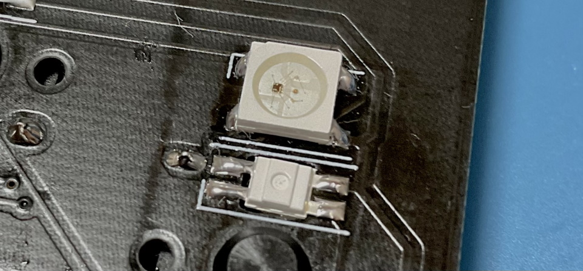
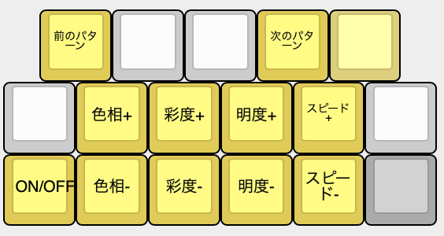

## LEDの取り付け方
LEDのはんだ付けはいつ行っても大丈夫です。  
一旦LEDなしで完成させてから後日やってもいいですし、ファームウェア書き込みの知識がある方は先にLEDだけ付けて発光のテストをすることもできます。  

LEDの切り欠きとシルク印刷のコーナーを合わせてはんだ付けしましょう。  
  
向きがバラバラなので毎回確認してください。  
メインボードにフラックスを塗り、こて先にのせたはんだを流し込むようにするとスムーズに付けられます。  
青丸はキースイッチを固定するだけの穴なので回路上どことも接続しておらずはんだが繋がってしまっても大丈夫ですが、choc V2の場合は穴が埋まってしまうとスイッチが入らなくなります。  
先にLEDを取り付ける予定の人ははんだ吸い取り線等を用意してください。
  

はんだ付けするだけでLEDが使えるようになります。  
ESC長押しでRGB操作用のレイヤーになります。  
  
[Keyboard Layout Editor で見る](http://www.keyboard-layout-editor.com/#/gists/2c37559177f8a87ce5277c5e55365e61)  

  ブラウザの機能で戻ってください。
