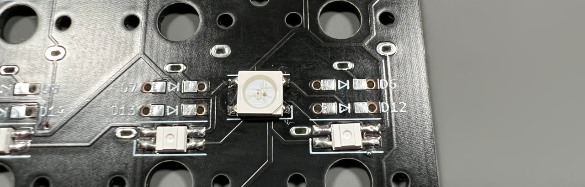

## LEDの取り付け方

LEDの切り欠きとシルク印刷のコーナーを合わせてはんだ付けしましょう。  
  
  
向きがバラバラなので毎回確認してください。  
  

右上のキーを長押しでRGB操作用のレイヤーになります。  
  
[Keyboard Layout Editor で見る](http://www.keyboard-layout-editor.com/#/gists/2c37559177f8a87ce5277c5e55365e61)  

ブラウザの機能で戻ってください。
